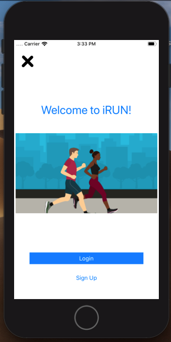
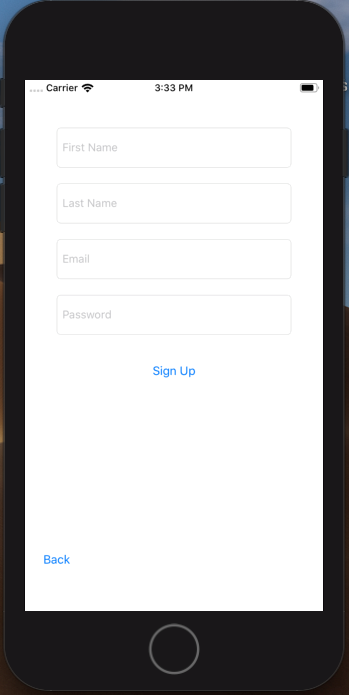
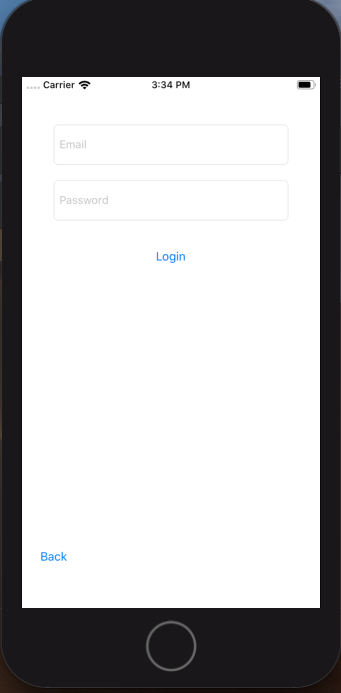
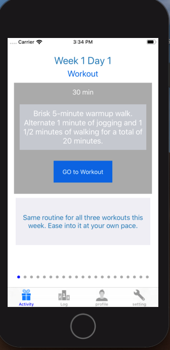
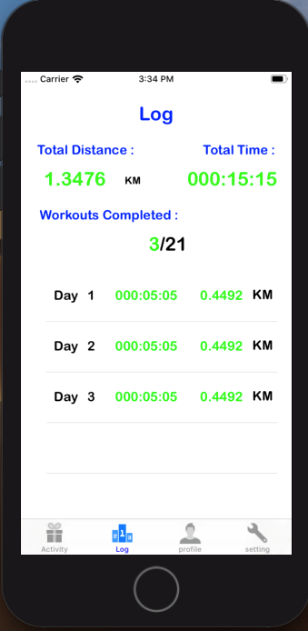
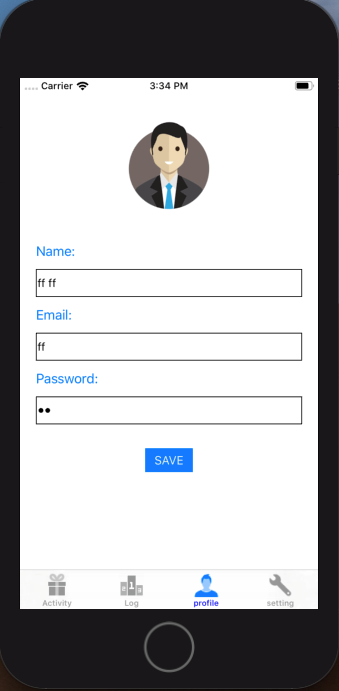
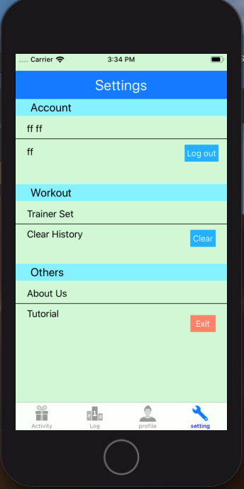
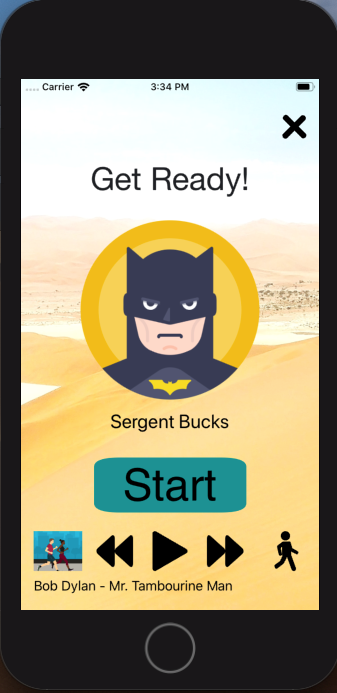
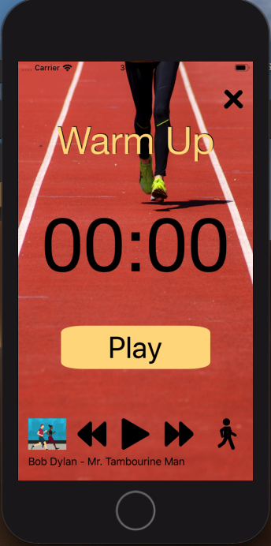

# iRun
It is an app for health care. It give instruction with voice command. Store everyday data and show total time and total running distance.
There is music in background.

## Feature :
1.Intro page\
2.Login and Registration\
    -use user defaults\
3.Home page using bottom navigation\
4.Log\
    -history of workout\
    -data save and show from SQLite3\
5.Profile\
6.Trainer\
7.music player in background\
8.show instruction\
    -voice command\
9.Settings\

## Team Mate
Name :Noyan Ali\
Roll :1607021\
cse,kuet\
work : Intro ,Login ,Registration\
\
\
\

Name :Sk Akash\
Roll :1607019\
cse,kuet\
work : Homepage with bottom Navigation\
\

Name :Tamzid Hasan Nahid\
Roll :1607005\
cse,kuet\
work : Log\
       -Database ->SQLite3\
       -TableView\
\

Name :RK Pranto\
Roll :1607017\
cse,kuet\
work : Profile ,Settings\
       -Defaults(share Preference)\
\
\

Name :Md. Shamim\
Roll :1607020\
cse,kuet\
work : Trainer ,workout Instruction ,Background music ,Voice command\
\
\

### Would be added
In future -> Firebase and distance measuring by GPS would be added...
